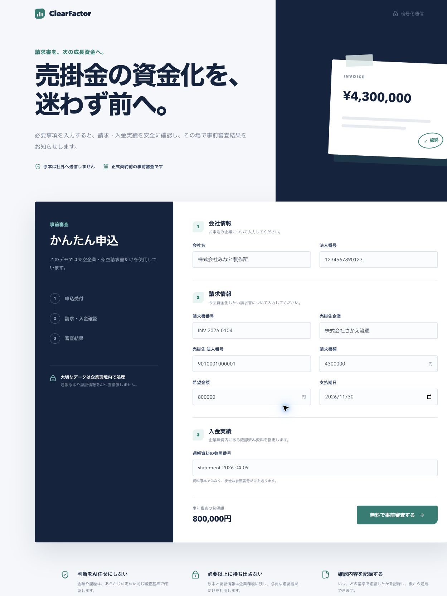
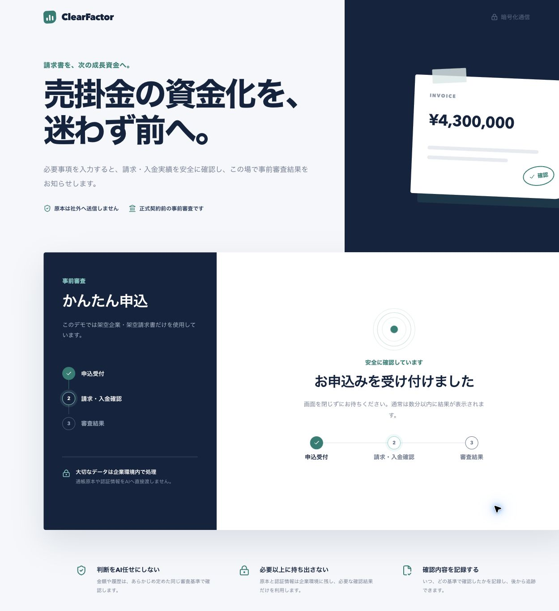
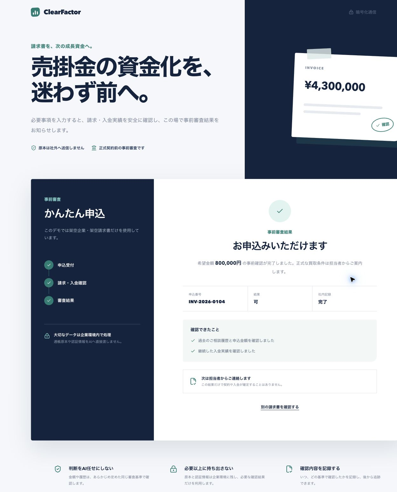

## まず、10秒で説明します

**Agent Studioは、「仕事をするAI」を自然な日本語から作り、テストし、配備するためのサービスです。**

ChatGPTのように質問へ答えるだけではありません。

たとえば、

> 申込データと入金実績を確認し、決められたルールでファクタリングの事前審査を行い、結果を社内DBへ記録するAgentを作ってください。

と頼むと、Agent Builder Agentが、必要な道具、仕事の順番、安全ルール、承認、実行環境を組み合わせます。

小学生向けにたとえると、次の違いです。

- 普通のAI Agent：仕事をするロボット
- Agent Builder Agent：仕事をするロボットを作る工場長
- Agent Studio：工場長がロボットを組み立て、試運転し、職場へ送り出す工場

今回、その具体例として、**申込フォームから審査結果の表示までを実際に通しました。**

:::message
この記事で使う会社、請求書、通帳、入金、コンプライアンス情報は、すべてハッカソン用の架空データです。「可」は契約の自動確定ではなく、担当者へ渡す事前審査の候補です。
:::

## できたものを先に見せます

申込者が使うのは、Agent Studioではありません。別のSaaSとして作った`ClearFactor`という申込サイトです。

### 1. 申込者が必要事項を入力する



*図1：Agent Studioとは別に作った申込サイト。請求書額430万円、希望額80万円などを入力します。*

ここで大事なのは、**お客様にAgent Studioの管理画面を触らせないこと**です。

- お客様が使う画面：ClearFactor
- 社内でAgentを作り、管理する画面：Agent Studio

銀行の利用者が、銀行内部の管理画面を直接触らないのと同じです。

### 2. 送信すると、裏側のAgentが仕事を始める



*図2：画面は「受付 → 請求・入金確認 → 結果」の3段階。表示だけのタイマーではなく、裏側のWorkflow Runの状態を読んでいます。*

この間、Agentは次の順番で動きます。

```text
申込を受け取る
  ↓
社内DBから申込・請求書・過去履歴を読む
  ↓
企業環境内で通帳資料を集計する
  ↓
コンプライアンス情報を照合する
  ↓
決められた審査ルールで判定候補を計算する
  ↓
承認ポリシーを確認する
  ↓
社内DBへ結果を1回だけ記録する
  ↓
申込サイトへ結果を返す
```

### 3. 実際のデータから結果が返る



*図3：希望額80万円の事前審査結果は「可」。社内記録も完了しました。*

実行結果は次の通りです。

| 確認項目 | 実際の結果 |
|---|---|
| 申込ID | `INV-2026-0104` |
| 希望額 | 800,000円 |
| 請求書額 | 4,300,000円 |
| 事前審査候補 | 可 |
| 理由1 | 過去の相談履歴があり、希望額が基準額未満 |
| 理由2 | 3か月の継続入金を確認 |
| 適用ルール | `factoring-v2` |
| 社内DB記録 | 完了（`screening_id=3`） |
| 二重登録 | なし（同じ実行キーは1件） |
| 外部SNS投稿 | 未実行 |

実行を追跡するIDは`674e402a-f279-4da8-a906-0276232e81e5`です。画面の「可」は、あらかじめ書いておいた答えではありません。この実行で読み取ったデータと`factoring-v2`の条件から返りました。

## いったい何がすごいのか

結論は、**AIが答えたことではなく、業務を安全に実行できるAIを自然言語から組み立てたこと**です。

普通のチャットAIへ「この会社を審査して」と聞くと、もっともらしい文章は返せます。しかし、会社の仕事として使うには、まだ足りません。

| 必要なこと | 普通のチャットAI | Agent Studioで作るAgent |
|---|---|---|
| 社内DBを見る | そのままでは見られない | 許可されたToolだけで読む |
| 通帳を扱う | 原本をAIへ渡しがち | 企業環境内で集計し、結果だけ渡す |
| 金額を判定する | AIの文章判断になりやすい | 固定ルールで毎回同じ判定 |
| 結果を書き込む | そのままではできない | 承認後、型付きToolで1回だけ記録 |
| 失敗を追う | 会話ログだけ | Run、Tool、承認、結果を記録 |
| 本番へ出す | 手作業が多い | 試したBuildを承認して配備 |

つまり、これは「賢いチャット」ではありません。

**会社の仕事を、決められた順番とルールで行うAI社員を作る仕組み**です。

## 本来、このAgentを作るのは大変です

ファクタリング審査Agentは、プロンプトを1本書けば完成するものではありません。

通常は、少なくとも次の開発が必要です。

1. 申込フォームを作る
2. 申込APIを作る
3. 社内DBの認証と取得処理を作る
4. 通帳PDFの読み取り処理を作る
5. コンプライアンス照合を作る
6. 審査ルールをコードにする
7. 読み取りと書き込みの権限を分ける
8. 承認画面を作る
9. 二重登録を防ぐ
10. Queue、Worker、Secret、ログ、監視を用意する
11. テスト環境から本番環境へ安全に出す

しかも、1つ失敗すると問題が大きくなります。

- AIが勝手に金額を判断する
- 通帳の中身や認証情報が外へ出る
- 同じ結果を2回登録する
- 社内記録の承認だけで、外部SNSにも投稿してしまう
- 後から「なぜ可になったのか」を説明できない

Agent Builder Agentは、この面倒な組み立てを毎回ゼロから行う代わりに、会社が登録した部品を選び、安全ルールを付け、1つの実行Agentとしてまとめます。

## 約4時間で、何を作ったのか

今回の約4時間は、完成済みの金融サービス全体を作った時間ではありません。**架空データを使い、申込から事前審査結果までを通す検証用の縦切りデモを組み立て、Preview環境で確認した時間**です。

| 時間 | Agent Builder側で行ったこと |
|---|---|
| 0:00〜0:30 | 日本語の要望を、入力・確認・判定・記録の仕事に分解 |
| 0:30〜1:20 | 必要なConnectorとToolを選択 |
| 1:20〜2:20 | Workflow、固定ルール、データの境界を構成 |
| 2:20〜3:10 | 承認、二重登録防止、外部公開の分離を設定 |
| 3:10〜4:00 | Previewで申込からDB記録まで実行し、結果を検証 |

申込者向けの`ClearFactor`画面は、Agent Studioの中には作っていません。これは意図的です。

- Agent Studioが作るもの：仕事をするAgent
- ClearFactorが担当するもの：お客様が使う商品画面

Agent StudioはSaaSの裏側へ組み込む基盤なので、どんな業界の画面からでも同じAgentを呼べます。

## Builderへ出した指示

実際の指示を、読みやすく短くすると次の内容です。

```text
架空データだけを使うファクタリング事前審査Agentを作ってください。

申込、請求書、入金実績、過去問い合わせ、社内否決情報を確認してください。
通帳資料は企業環境内で集計し、原本や口座情報をAIへ渡さないでください。
コンプライアンス情報を照合してください。

審査はAIの感覚ではなく、固定ルールで「可候補・否・保留」を決めてください。
社内DBへの記録は承認後だけ行い、同じ実行を再開しても二重登録しないでください。
外部公開は社内記録とは別の承認にしてください。
```

Builderはこの文章を、次の部品へ分けます。

- **Tool**：Agentへ持たせる仕事道具
- **Connector**：社内システムへ安全につなぐ接続口
- **Workflow**：仕事を行う順番表
- **Policy**：してよいこと、してはいけないこと
- **Human Gate**：人の確認が必要な場所
- **Build**：使うAgent、Tool、ルールの版を固定した完成品

## 実際に、どのデータへどうアクセスしたのか

### 1. 申込と社内履歴を読む

`get_application`というToolが、業務APIを通して`factoring_demo`データベースを読みました。

読み取ったのは、申込、請求書、過去の入金、過去問い合わせ、社内否決フラグ、重複請求書の有無です。

AgentはDBへ好きなSQLを送れません。図書館で「倉庫へ勝手に入る」のではなく、受付へ本の番号を渡して必要な本だけ受け取るイメージです。

### 2. 通帳は企業環境の中で集計する

Agentへ渡したのは、通帳そのものではなく`statement-2026-04-09`という参照番号です。

Self-hosted Runtimeの中で資料を処理し、外へ返したのは次の集計結果だけです。

```json
{
  "continuous_months": 3,
  "all_payer_names_match": true,
  "raw_text_included": false
}
```

つまり、通帳の原本や口座番号を持ち出さず、「3か月続けて入金がある」「名義が一致した」という確認結果だけを使います。

### 3. コンプライアンス情報を照合する

`check_compliance`が、架空の法人番号を許可済みMockデータと照合し、`clear`を返しました。

このデモは実在企業の反社情報や信用情報には接続していません。

### 4. LLMではなく固定ルールで判定する

`evaluate_factoring_rules`が`factoring-v2`を実行しました。

今回「可候補」になった理由は次の通りです。

1. 過去の問い合わせがある
2. 希望額80万円が基準の100万円未満
3. 3か月の継続入金がある
4. 支払名義が一致している
5. コンプライアンス結果が`clear`
6. 社内否決フラグと重複請求書がない

LLMは、この結果を読みやすく説明します。しかし、LLM自身が「なんとなく良さそうだから可」と決めることはありません。

### 5. 承認後、結果を1回だけ記録する

`record_screening`が、事前審査候補を業務DBへ記録しました。

```text
screening_id: 3
invoice_id: INV-2026-0104
decision: 可
idempotency_key: 674e402a-f279-4da8-a906-0276232e81e5
同じidempotency_keyの件数: 1
```

`idempotency_key`は、二重登録を防ぐ受付番号です。同じ実行が再開されても、同じ結果を何件も作りません。

## 承認を全部通し、結果だけ見せる設定

デモ中に毎回「承認」ボタンで止まると、審査員には結果まで見せられません。そこで承認モードを分けました。

| モード | 動き |
|---|---|
| `manual` | 承認のたびに人が確認する。本番向け |
| `safe_auto` | 架空データの社内確認とDB記録だけ自動承認する。通常デモ向け |
| `all` | 外部公開を含めて自動承認できる。明示的な追加フラグが必要 |

今回の実演は`safe_auto`です。そのため、申込者は途中で待たず、最終結果だけを見られます。

ただし、安全のため、社内DBへの記録と外部SNS投稿は別の権限にしました。今回、Xへの投稿は実行していません。

これは「ブレーキを外した」のではありません。**ブレーキを残したまま、閉じたデモ環境では決められた範囲だけ自動で通した**ということです。

## Self-hosted Runtimeを、一言で説明すると

**会社の大切なデータのそばでAgentを動かすための、社内作業室です。**

```text
Agent Studio（工場の管理室）
  ├─ Agentの設計
  ├─ Version管理
  ├─ 実行状況と承認の記録
  └─ どの仕事を実行するか指示
             │ 外向きHTTPS
             ▼
企業AWSのSelf-hosted Runtime（鍵のかかった作業室）
  ├─ Secret
  ├─ 社内DB
  ├─ 通帳資料
  └─ Tool Gateway
```

Agent Studioから企業ネットワークへ自由に入る構成ではありません。企業側のRuntimeが外向き通信で仕事を受け取り、許可されたToolだけを実行します。

### ToolとConnectorの違い

ここは審査員から聞かれやすいポイントです。

- **Connector**はコンセント：どのサービスへ、どう認証してつなぐか
- **Tool**は家電：つないだ先で、何をしてよいか

同じDB Connectorを使っても、「申込を読むTool」と「審査結果を書くTool」を分けられます。読む権限だけのAgentへ、書く能力まで渡す必要はありません。

### Tool Gatewayの役割

Tool Gatewayは、Agentと社内システムの間にいる門番です。

次のことをコードで確認します。

- そのAgentに許可されたToolか
- 入力の形が正しいか
- 読み取りか、書き込みか、金融操作か
- 必要な承認が済んでいるか
- 同じ処理を繰り返していないか
- 誰が、いつ、何を実行したか記録できるか

Promptに「悪いことをしないで」と書くだけではなく、**モデルの外側で止められる**のが重要です。

## Agent Builder Agentの技術的な流れ

Builderは日本語を、そのまま長いPromptへ貼るわけではありません。

```text
自然言語の依頼
  ↓
必要な仕事へ分解
  ↓
既存Toolを検索。不足するToolは契約から作る
  ↓
Connector、Workflow、Policy、承認を組み合わせる
  ↓
使うVersionをBuildとして固定する
  ↓
Previewで実データの代わりに架空データを使って試運転する
  ↓
確認済みのBuildを、承認後にProductionへ昇格する
```

今回確認したのはPreview/self-hostedテスト環境までです。公開本番へ出した、実在顧客を審査した、Xへ投稿した、という意味ではありません。

## 審査員へ伝えたい4つの価値

### 1. 自然言語が「回答」ではなく「動く業務」になる

生成されるのは文章だけではありません。Tool、処理順、承認、監査、配備まで含むAgentです。

### 2. AIに全部の権限を渡さない

Agentが使えるのは、登録済みの小さなToolだけです。DB接続情報やSecretを直接持ちません。

### 3. AIに金融判断を丸投げしない

金額、継続月数、重複、社内フラグは固定ルールで判定します。LLMは整理と説明を担当します。

### 4. デモで終わらず、会社の運用へつなげられる

Versionを固定し、Previewで試し、承認して配備し、実行履歴を残します。「昨日と今日で勝手に動きが変わる」を避けられます。

## 3分デモで見る場所

1. ClearFactorで80万円の申込を送る
2. 「請求・入金確認」へ進むことを見る
3. 結果「可」と社内記録「完了」を見る
4. Agent Studioで同じRun IDの実行履歴を見る
5. Toolが読んだデータ、固定ルール、承認、DB記録を説明する

見せたいのは、豪華な画面ではありません。

**1回のボタン操作が、別画面の演出ではなく、裏側のAgent、Tool、ルール、承認、DB記録までつながっていること**です。

## よくある質問

### 「普通のRAGやチャットボットとの違いは？」

検索して答えるだけでなく、型の決まったToolを呼び、条件分岐し、承認を通し、DBへ記録し、実行証跡を残します。さらにAgent Builder Agentは、その実行Agent自体を作ります。

### 「LLMが融資や契約を決めるの？」

決めません。今回の結果は、固定された`factoring-v2`が出した事前審査候補です。正式契約は担当者が行います。

### 「顧客データはAIへ全部送るの？」

送りません。通帳原本やSecretはSelf-hosted Runtimeへ残し、Agentには確認に必要な集計結果だけを返します。

### 「4時間で本番運用できるの？」

4時間で作ったのは、架空データを使った縦切りデモです。本番には、実接続先の契約、審査規程、セキュリティレビュー、評価、監視、Production承認が必要です。Agent Studioはそれらを飛ばすのではなく、作成・検証・承認・配備を同じ流れで管理します。

### 「失敗したら、勝手に可になるの？」

なりません。DB、通帳、コンプライアンスのどれかを確認できない場合は、都合のよい値を作らず「保留」にする設計です。

## まとめ

今回作ったものを一文で表すと、次の通りです。

> Agent Studioは、自然言語から、社内データに安全につながり、決めたルールで仕事を実行し、証拠を残すAI Agentを作って配備する「AIを作るAI」です。

ファクタリング審査は、その価値を見せる一例です。

申込フォームは別のSaaSとして自然に見せつつ、その裏側では、Agentが必要なデータだけを読み、固定ルールで候補を出し、許された範囲だけ書き込み、すべてを記録します。

**AIに質問する時代から、AIに「安全に働くAI社員」を作らせる時代へ。**
